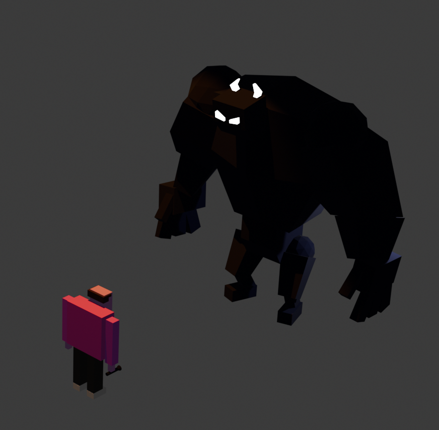
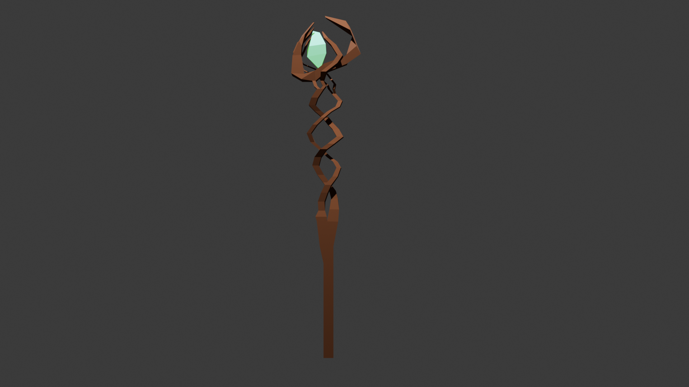
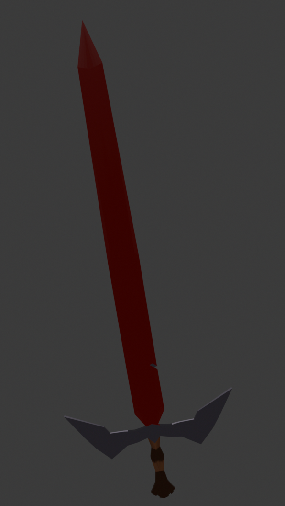

Okay so after all the moving around and linear algebra and everything else comes the part I really fear. Designing the character so I can move it.

This blog is moreso of a confession than anything else, I genuinely didn't think I would be able to ever use Blender. Some years ago, while being sick, I tried doing a small ant I wanted to animate in Blender. And I failed.. horribly. I followed the classic donut, but that was an absolute and utter failure. I gave up after 3 days of fever dreams, both real and metaphorical ones (due to actually having a fever, oopsie).

So, I started my Blender journey again reluctantly (I would not even bother with it if I had money to pay for predefined models.. though I'm starting to dig the idea of being in charge of my own vision for the game), and this time I had a plan:

1. Learn the easiest Shortcuts
2. Learn how to model simple objects
3. Learn how to model more complex objects (like a staff or a character)
4. Learn Texture Painting
5. Choose a color scheme
6. Move on with your life

All of the above, while taking into consideration that for TURRIS, I want the main character to be as simple as possible, as close to a naked stickman as possible.

The reason for that is that I remember playing WC3 online on random servers, and every now and again you'd find these modded servers that were really cool, where you'd get a character that you're used to (Juggernaut for example), and then based on the items you'd find, you'd equip them, like a flaming sword, or a hat, or an orb orbiting around you. And what made me feel cool wasn't the character itself, sure Juggernaut was nice, but the feeling of seeing my own struggle plastered on top of something that's generic. Kind of like, my character is generic, but the items you farm are the ones giving it identity.

Realistically, up to this point I'm not sure how low-poly or smooth-edges I want to go with this, because I feel that a low-poly game will just be treated as having been done in a rush, no matter how good its content is.. So I might spend some time here trying things out.

I guess everyone will see how the choices are formed along this gameblog.

So, going back to the above list, I started off strong with some videos: https://www.youtube.com/watch?v=kVcY7K-JA1Y&list=PLn3ukorJv4vv9_e-htADGsPX9TMaQpHV8 - Grant Abbitt really is a master of explaining things, and I felt like I was making progress this time around, so it was lots of fun!

After all of that, I actually could create this scene:

This was nice, so I went ahead and tested my skills trying to build a sword and a staff, free-hand (bad choice):

They both look quite decent, and I added some materials on them. However, only the staff feels like something I would find cool-looking in a game, and even that looks a bit blocky. I'm a bit stuck on performance vs real feel, given that my player will be an RPG with an orbit camera.. so I can't really cut corners (pun intended). Either way, this article will be updated along as I study the resources.

Hope you have a good one!