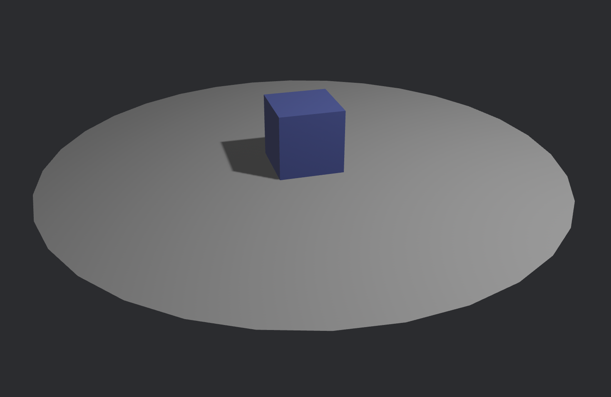
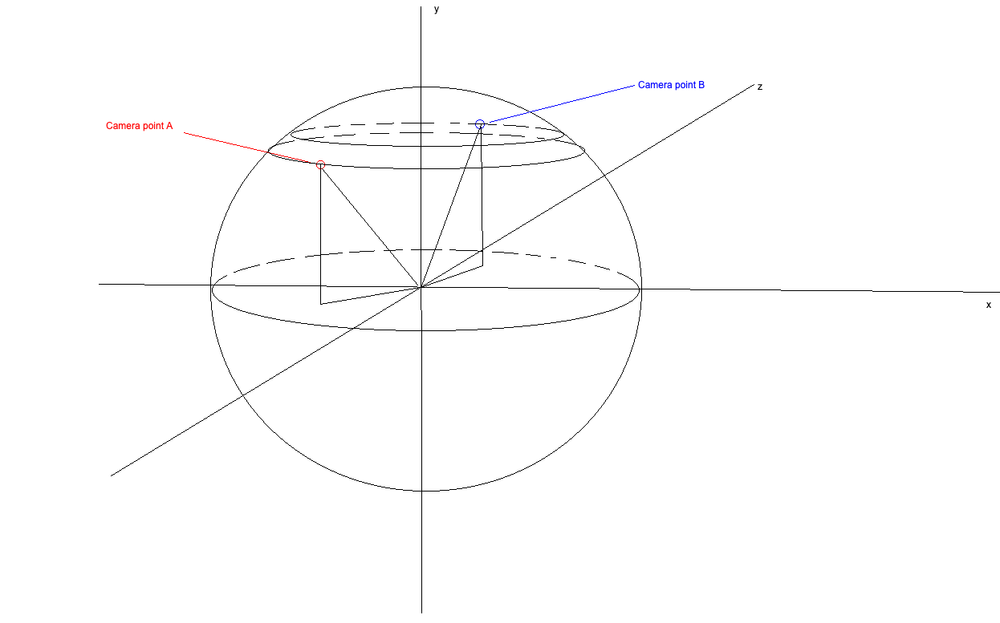
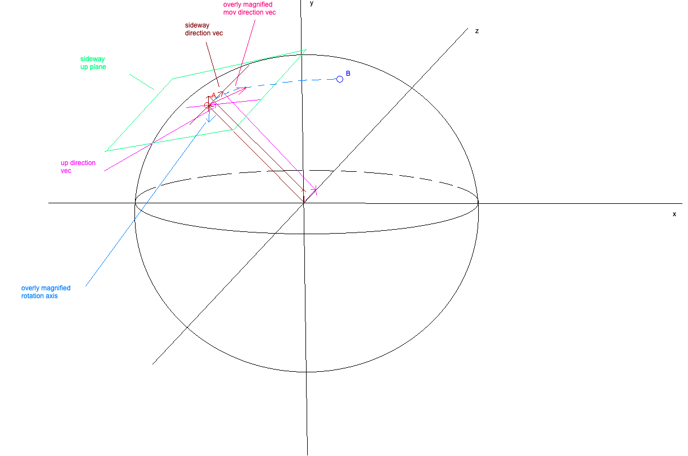
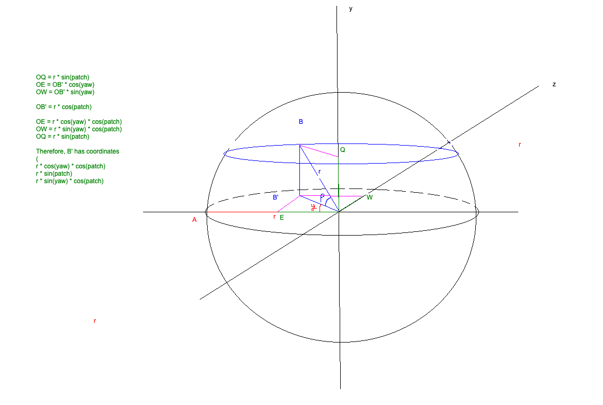
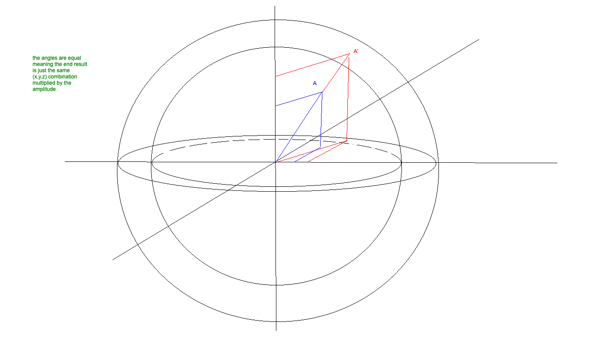

I did not know exactly where to start, so I imagined that the first thing I should be able to achieve in my game is.. well.. look around?

I added the `bevy` crate to my project and hammered away at mathematics for about 8 hours.

The first thing I did, without much knowledge was to steal code from [Bevy's example page](https://bevy.org/examples/3d-rendering/3d-scene/) and drop it in my code.




So far so good, I have an object to look at.

I have fiddled with fixed cameras before for 2D games, and all of that was good and fun. Dragging across a 2D plane, would keep you in that 2D plane, zug zug, job's done.

However, in 3D, that's not quite as simple, because well, you've got 2 approaches to the camera:
1. Zoom in/ out, which is generally done through the mouse wheel drag.
2. Rotate around, which is done with the mouse click + drag.

So, I first dealt with rotation, as it felt more natural.

What this entailed, in my brain, was that my camera is fixed on a sphere with a certain radius, just walking along the surface of that sphere.



Basically, if in point A, you drag your mouse to the right and a bit up, you'd end up in the point B, at exactly the same distance `radius` from the center of the sphere.

The center of the sphere, in the future, will be out character.

So, I went ahead and searched extensively on how this can be portrayed from a 2d movement. The initial answer was.. cross products. So, obviously, as I had completely forgotten what cross products are and what they intend to achieve, I went to 3B1B's videos and had a quick refresher. By the way, I really recommend this channel, it made me visualize a lot of concepts in a physical manner: www.youtube.com/shorts/94nxKCafsn8 .

So, in theory, the first thing I need to do is to translate the movement from my 2d plane in which the cursor moves, to the 3d plane of the sphere.

First of all, I must mention that the `radius_vec` is just the vector from the origin to the current point that the camera situates itself in.

In order to do that, the first thing is to find out what the tangent plan to the current point is, because that's where I'll be defining my movement direction.

So

```rust
let sideway_direction = Vec3::Y.cross(radius_vec).normalize();
let up_direction = radius_vec.cross(sideway_direction).normalize();

```

This way, we're getting 2 axes, `sideway_direction` and `up_direction` which create a plane upon which the `radius_vec` representing the vector from the origin to the point A is perpendicular.

We're normalizing this, because we're only interested in directions, not amplitude values.

Then, we're getting the vector created by the cursor movement in its 2D plane: \[dx, dy].

We're going to translate that into a free vector, in our \[sideway_direction, up_direction] plane, by a simple multiplication + addition.

```rust
let movement_direction = (sideway_direction * dx + up_direction * dy).normalize();
```

Now, we know which direction the point should move towards.

The amplitude of the movement (the distance we're be going to be doing) is just a `(dx * dx + dy * dy).sqrt()`.

Now comes the weird part.

What we need to do, is rotate our original radius vector, which regards to an axis based on this plane and movement vector, to end up in point B on the sphere.

So, in order to get that axis, we need a vector perpendicular to the \(radius_vec, movement_direction) plane.. so.. cross products?

```rust
let axis = radius_vec.cross(movement_direction);
```

So now, this is where the mathemagical part happens, because we're going to be building a rotation in Rodrigues' formula, that's nicely baked in the Bevy engine.

```rust
let angle = distance / radius;
let rotation = Quat::from_axis_angle(axis, angle);
```

What's left here is to rotate my vector across that computed axis, based on the angle, to reach the correct point:

```rust
radius_vec.rotate_around(center, rotation);
```

The graphic below helped me tie it all together:



Cool, this was .. achieved! It actually works, I hardcoded some dx, dy values and let it fly. Then, obviously, like any other average developer, I asked Claude to review my code, and it told me the implementation is solid! GOLD! (though I don't really trust LLMs, and their output in scenarios like this is questionable). It did tell me that my approach was complex, and most game engines, such as Unity use a thing called an Orbit Camera.

Hmm.. interesting..

So I looked into it, and we've got this things called yaw, pitch and radius. I for sure know what radius is, and I've found out that apparently:
1. yaw is the angle upon the vector has moved projected in the \[x,z] plane
2. pitch is the angle upon the vector has moved projected in the \[y,z] plane

So.. I went ahead and did some maths to find out what exactly happens here, and why this yields similar results to the cross products.



I've moved the points A and B for ease of use, but basically, this is just very simple unexpensive mathematics based on angles, which from an initial point A, I can compute the new relative point B in 3d space based on 2D movements, such as:

```rust
orbit.yaw -= delta.x;
orbit.yaw = orbit.yaw.rem_euclid(std::f32::consts::TAU);;
orbit.pitch = (orbit.pitch + delta.y).clamp(-MAX_PITCH, MAX_PITCH);
```

At this point, dx and dy represent just the values by which the angles are being modified.

You can see weird things I've done here:

1. I've constrained the yaw between \[0, 2pi], as the cos/ sin functions are periodcal.
2. I've constrained the pitch between `-MAX_PITCH` and `MAX_PITCH`, as once you get very close to the `Oy`, the camera starts acting up.

After this, I've got a nice new B point:

```rust
let x = orbit.radius * orbit.pitch.cos() * orbit.yaw.sin();
let y = orbit.radius * orbit.pitch.sin();
let z = orbit.radius * orbit.pitch.cos() * orbit.yaw.cos();
```

This is less expensive than computing 3 cross products, and generally simpler to wrap my head around, so I'll go with this one moving forward.

Now, what remains to be done is the zoom.. In my understanding, if I zoom in or out, I just modify the radius, therefore, the amplitude of the vector. My hypothesis here is that if I modify the amplitude of the vector by a factor of `c`, then it's \[x, y, z] values will be modified by the same factor of `c`.



And well, after some basic maths, that seems indeed to be the case.

So after all that, I just get:

```rust
// only delta.y is relevant, because we're not implementing sideway scrolling
orbit.radius = (orbit.radius - delta.y).clamp(MIN_RADIUS, MAX_RADIUS);

let x = orbit.radius * orbit.pitch.cos() * orbit.yaw.sin();
let y = orbit.radius * orbit.pitch.sin();
let z = orbit.radius * orbit.pitch.cos() * orbit.yaw.cos();
```

So, after all of this, we've got a functional drag and scroll camera which fixates on my pretty cube!

I think the next step will be to make the cube jump around, but boy am I scared of the object contact physics. I think I'll be using avian3d for this.

See you later!