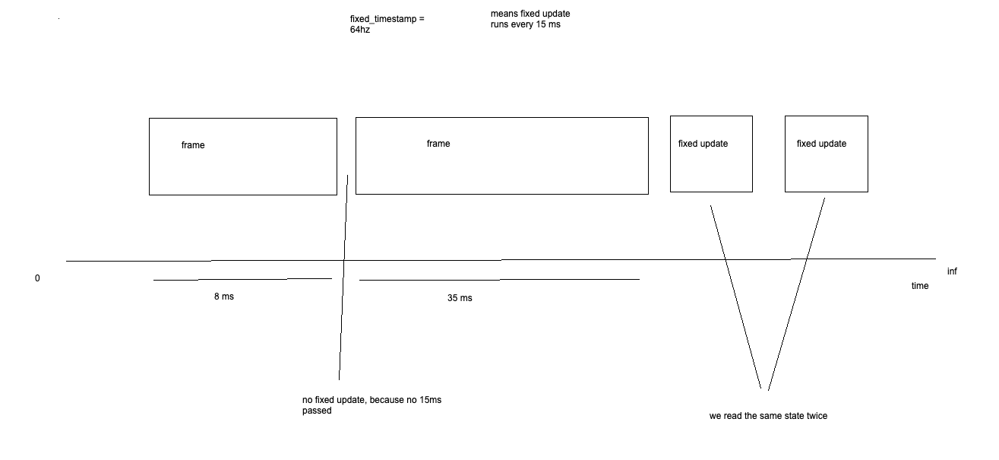
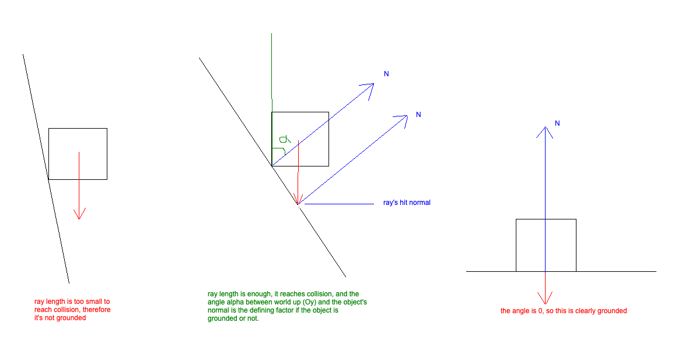
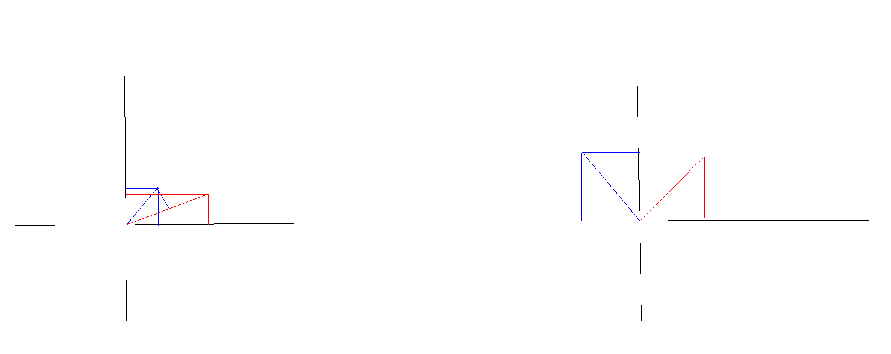
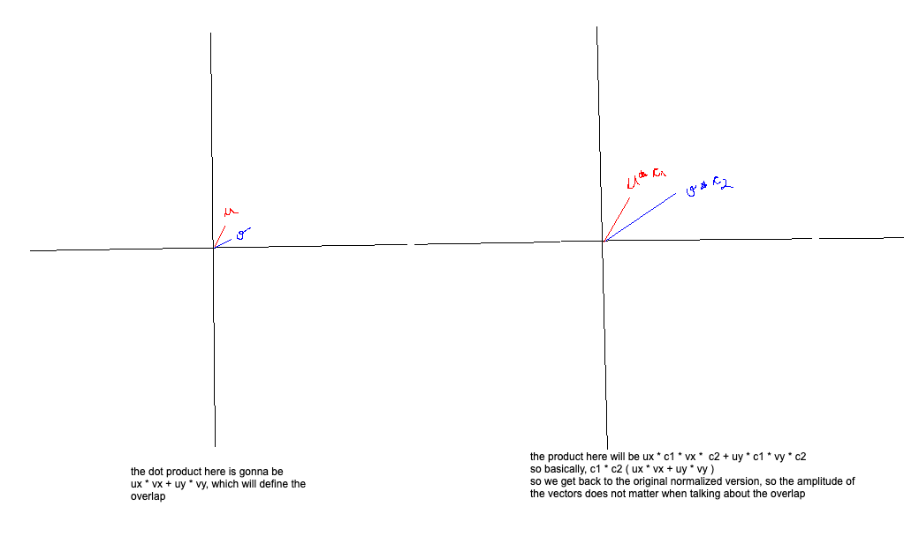
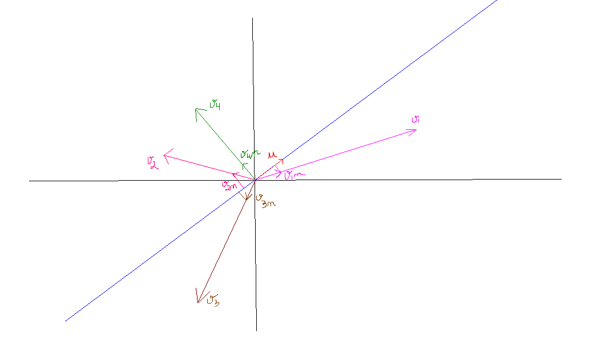
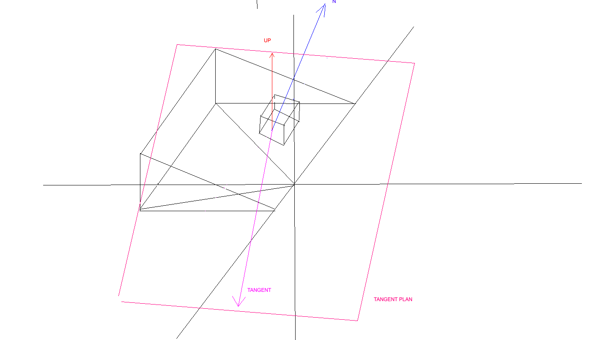

Okay so, remember how I said I was scared of object contact physics? Yup, I was spot on.

So, I tried doing something like really basic on top of the example bevy code. I made my Dynamic Body move around by pressing keys, jump around, all was well. I had no idea what a Dynamic Body is in avian3d, but hey, when it jumped, it went down on its own according to gravity, so that was awesome.

I even did some raycasting to only allow jumps when the angle is less than 70 degrees ( what actually helped me understand what raycasting is was a Roblox raycasting tutorial: https://www.youtube.com/watch?v=YipkISTwGlc&t=409s).

However, the issues appeared when I spawned a 90 degree wall. I expect to jump at it, and kinda fall along as if gravity didn't exist, like most games do. NOPE.

What happened is that once I jumped on it while pressing the forward manner, I was actively applying force, thus creating friction. In addition to that, I could basically keep jumping until my ray length was reached, so I could.. do like 7 jumps in a row.

So.. I went ahead and googled the hell of what's going on, and I found out the next:

Generally, when writing character controls, you decouple the controllable character with a `Kinetic Character Controller`, a `KCC`. What... is a `KCC`?

Glad you asked! Basically avian 3d offers the `RigidBody` enum as such

```rust
pub enum RigidBody {
	Static,
	Dynamic,
	Kinetic,
}
```

1. `RigidBody::Static` - this is an immovable object.
2. `RigidBody::Dynamic` - this is a movable object, that is governed by the physics engine - a thing in the air, will be under the influence of gravity - hitting this object with enough force, based on its friction, will move it (I think).
3. `RigidBody::Kinetic` - this is a movable object, that is not governed by the physics engine - basically, you're on your own here, to roll out everything from linear velocity updates (which get wired in the physics engine), gravity, collision, and basically everything else.

Cool, so, let's `BORROW` again: https://github.com/avianphysics/avian/tree/main/crates/avian3d/examples/kinematic_character_3d

So, I'll go through each of the things in the `plugin.rs` file, as my own understanding dump here, maybe it'll help one day.

```rust
/// A [`Message`] written for a movement input action.

#[derive(Message)]
pub enum MovementAction {
	Move(Vector2),
	Jump,
}
```

This MovementAction is the message we'll producing prior to the `Update` systems, through a `PreUpdate` system, which will be consumed in a `FixedUpdate` system.

Apparently:
1. `Update` + `PreUpdate` and `FixedUpdate` run at different decoupled rates.
	1. The former produces the input, and the latter consumes it.
2. `Update` + `PreUpdate` - runs once per rendered frame
3. `FixedUpdate` - runs a fixed number of times per second, as many times in a row needed to consume the accumulated real time - this is because physics need a fixed, deterministic timestep, otherwise a slow computer (which renders frames more slowly) will have the character behave more slowly as opposed to a fast computer.
	1. A good counter example here is imagining that we run `FixedUpdate` twice, because it needs to catch up to the accummulated time.



4. FixedUpdate runs a SET number of times
	3. Let's say a frame takes 100 ms to load
	4. It means we render 10 frames per second
	5. The fixed_timestamp is 64 Hz, meaning it runs 64 times.
	6. Then, after every render, I'll get a bunch of fixed update runs ( 100 / (1000 / 64) )

And for these particular reasons, we need to decouple the user input related to movement from the actual frame rendering, and create messages to be consumed, if there are any.

```rust
/// Sends [`MovementAction`] events based on keyboard input.
fn keyboard_input(
	mut movement_writer: MessageWriter<MovementAction>,
	keyboard_input: Res<ButtonInput<KeyCode>>,
) {
	let up = keyboard_input.any_pressed([KeyCode::KeyW, KeyCode::ArrowUp]);
	let down = keyboard_input.any_pressed([KeyCode::KeyS, KeyCode::ArrowDown]);
	let left = keyboard_input.any_pressed([KeyCode::KeyA, KeyCode::ArrowLeft]);
	let right = keyboard_input.any_pressed([KeyCode::KeyD, KeyCode::ArrowRight]);

	let horizontal = right as i8 - left as i8;
	let vertical = up as i8 - down as i8;
	let direction = Vector2::new(horizontal as Scalar, vertical as Scalar).clamp_length_max(1.0);

	movement_writer.write(MovementAction::Move(direction));

	if keyboard_input.just_pressed(KeyCode::Space) {
		movement_writer.write(MovementAction::Jump);
	}
}

/// Sends [`MovementAction`] events based on gamepad input.
fn gamepad_input(mut movement_writer: MessageWriter<MovementAction>, gamepads: Query<&Gamepad>) {
	for gamepad in gamepads.iter() {
		if let (Some(x), Some(y)) = (
			gamepad.get(GamepadAxis::LeftStickX),
			gamepad.get(GamepadAxis::LeftStickY),
		) {
			movement_writer.write(MovementAction::Move(
				Vector2::new(x as Scalar, y as Scalar).clamp_length_max(1.0),
			));
		}
		if gamepad.just_pressed(GamepadButton::South) {
			movement_writer.write(MovementAction::Jump);
		}
	}
}
```

```rust
/// A marker component indicating that an entity is using a character controller.
///
/// This also requires the entity to have a `CustomPositionIntegration` component, which is used
/// to prevent Avian from automatically applying the character's velocity to its position,
/// since the character controller will handle movement manually using move-and-slide.

#[derive(Component)]
#[require(RigidBody::Kinematic, CustomPositionIntegration)]
pub struct CharacterController;
```

This is self explanatory, but this is basically the component we'd be using to anything that needs to move according to a controllable path, like a character, or an enemy.

```rust
/// Component for configuring ground detection for a character controller.
#[derive(Component)]
pub struct GroundDetection {
	/// The maximum angle (in radians) where a surface is considered ground/ceiling
	/// relative to the up-direction. Outside of this angle, surfaces are considered walls.
	///
	/// **Default**: 30 degrees (π / 6 radians)
	pub max_angle: Scalar,
	/// The maximum distance for ground detection.
	pub max_distance: Scalar,
	/// The shape cast collider used for ground detection.
	pub cast_shape: Option<Collider>,
}
```

HaHA! Something I know, this is basically the configuration we'll add to the entity that will define the raycast behaviour for ground detection - we don't want our characters to be able to infinitely jump in the air, or on 90 degree walls. We only want them to jump when they're grounded, and as physics dictates, when they can actually generate force downward which can boost them upwards.

```rust
/// A marker component indicating that an entity is on a surface that is considered
/// ground, meaning the steepness is less than [`GroundDetection::max_angle`].
///
/// Characters that are grounded can jump, and do not slide down slopes.

#[derive(Component)]
#[component(storage = "SparseSet")]
pub struct Grounded;
```

This is quite interesting, because as opposed to my previous impl, when we updated the grounded in each frame, we're now adding or removing this component. The reason we're doing this, is to only query data that we need in future systems. It's similar to SQL, where you'd only get specific records based on filters, because there's no way in Bevy where you can filter before the iteration starts.

Well, now that we're here, this is basically what raycasting does in my brain in order to define if a thing is grounded or not.

```rust
/// Updates the [`Grounded`] status for character controllers.

fn update_grounded(
	mut commands: Commands,
	mut query: Query<(Entity, &GroundDetection, &GlobalTransform)>,
	spatial_query: SpatialQuery,
) {
	for (entity, ground_detection, global_transform) in &mut query {
		let Some(collider) = &ground_detection.cast_shape else {
			continue;
		};
	
		let translation = global_transform.translation().adjust_precision();
		let rotation = global_transform.rotation().adjust_precision();
	
		// Cast the shape downward to check for ground
		let hit = spatial_query.cast_shape(
			collider,
			translation,
			rotation,
			global_transform.down(),
			&ShapeCastConfig::from_max_distance(ground_detection.max_distance),
			&SpatialQueryFilter::from_excluded_entities([entity]),
		);
	
	  
		// The character is grounded if we hit a surface that isn't too steep
		let is_grounded = hit.is_some_and(|hit| {
			let up = global_transform.up().adjust_precision();
			(rotation * hit.normal1).angle_between(up) <= ground_detection.max_angle
		});
	
		// Update grounded state
		if is_grounded {
			commands.entity(entity).insert(Grounded);
		} else {
			commands.entity(entity).remove::<Grounded>();
		}
	}
}
```



The photo above explains it, but basically what happens is:

1. Did my ray hit?
2. If it didn't, then it's not grounded.
3. If it did, then is the angle between the (hit's normal * rotation of the object) and (world up) smaller than an angle?
4. If not, not grounded, can't jump, and should slide.
5. If it is, add grounded to the entity for future before-iteration filters.

Now, let's look at movement!

Then we've got the big configuration boy:

```rust
/// Component for configuring movement settings for a character controller.

#[derive(Component)]
pub struct CharacterMovementSettings {
	// Normal speed, happening when not speeding.
	pub normal_speed: Scalar,
	/// The damping coefficient used for slowing down movement.
	pub damping: Scalar,
	/// The strength of a jump.
	pub jump_impulse: Scalar,
	/// The gravitational acceleration used for the character.
	pub gravity: Vector,
	/// The maximum speed that gravity can accelerate the character to.
	/// This prevents the character from accelerating indefinitely while falling.
	pub terminal_velocity: Scalar,
}
```

```rust
/// Responds to [`MovementAction`] events and moves character controllers accordingly.

fn movement(
	mut movement_reader: MessageReader<MovementAction>,
	mut controllers: Query<(
		&CharacterMovementSettings,
		&mut LinearVelocity,
		Has<Grounded>,
	)>,
) {
	for event in movement_reader.read() {
		for (movement, mut linear_velocity, is_grounded) in &mut controllers {
			match event {
				MovementAction::Move(direction) => {
					linear_velocity.x = direction.x * movement.normal_speed;
					linear_velocity.z = direction.y * movement.normal_speed;
				}
				MovementAction::Jump => {
					if is_grounded {
						linear_velocity.y = movement.jump_impulse;
					}
				}
			}
		}
	}
}
```

If the event sent here is a Move, then we're modifying the linear velocity on the \[x,z] plane.
If the event sent here is a Jump, then we're modifying the linear velocity on the Oy axis.

Now, let's take a look at gravity, otherwise our character will just be infinitely going upward.

```rust
/// Applies gravity to character controllers.
fn apply_gravity(
	time: Res<Time>,
	mut controllers: Query<(&CharacterMovementSettings, &mut LinearVelocity)>,
) {
	let delta_secs = time.delta_secs_f64().adjust_precision();
	
	for (movement, mut linear_velocity) in &mut controllers {
		let gravity_direction = movement.gravity.normalize_or_zero();
		let velocity_along_gravity = linear_velocity.dot(gravity_direction);
		if velocity_along_gravity > movement.terminal_velocity {
		// Don't apply more gravity if we're already at terminal velocity.
			continue;
		}
		
		// Calculate the new velocity after applying gravity.
		let new_velocity = linear_velocity.0 + movement.gravity * delta_secs;
		
		// Don't exceed terminal velocity.
		let new_velocity_along_gravity = new_velocity.dot(gravity_direction);
		if new_velocity_along_gravity < movement.terminal_velocity {
			linear_velocity.0 = new_velocity;
		} else {
			linear_velocity.0 = gravity_direction * movement.terminal_velocity;
		}
	}
}
```

Ok so.. this is where linear algebra kicked me in the gut for a bit, I didn't understand what the dot product had to do with anything here. It was clear to me that the dot product is used to measure the overlap between the vectors, however, I didn't know WHY that happened, so once again, 3b1b to the rescue: https://www.youtube.com/watch?v=LyGKycYT2v0

However, this made me only more confused, w.r.t. projections and whatnot, so I went ahead and did a lil graphic.



In the first image, the dot product has a positive value.
In the second image, the dot product is close to 0, or even 0 if the 2 vectors are perpendicular on each other.



Now, let's take that into consideration, and think what the dot product really does.



Let's assume we have a vector, that will be the plane upon which we are going to be transforming our 2d vectors in our 1d (only-length).

We have the vector u.

We then have 4 more other vectors, at different angles.

Using the prior graphic, we can deduce that we can just normalize them, as the dot product result scales with the scale of our vectors.

Now, we can see that v1n, v2n and v3n have some values, because they're at different angles to u.

Now, v4n is the interesting one, because that's the perpendicular one, and its dot product (the projection on the u axis) will be 0. This is what the dot product tells us.. HOW MUCH OVERLAP IS BETWEEN MY VECTORS? Obviously, it also tells me the direction of the overlap, for example v3 and v2 are both negative "overlaps" let's say.

Okay, going back to our code now, we do 

```rust
let velocity_along_gravity = linear_velocity.dot(gravity_direction);
```

Which is basically computing the amplitude of our character in the Oy axis (gravity direction only has y different from 0.).

However, this amplitude can be either positive, or negative, let's take the next example:

1. We press space
2. LinearVelocity along the Oy axis gets some positive value `POS_VALUE`.
3. The next time we run this, the dot product will be something like
```
velocity = (0 * linear_velocity.x + (-1) * POS_VALUE + 0 * linear_velocity.z)
=>
velocity =  -POS_VALUE
```

4. Then we move along to check if our current speed is higher than the limit falling speed

```rust
if velocity_along_gravity > movement.terminal_velocity {
	// Don't apply more gravity if we're already at terminal velocity.
	continue;
}
```

5. We compute the new falling velocity, based on how much time it has been since the last `FixedUpdate`

```rust
let new_velocity = linear_velocity.0 + movement.gravity * delta_secs;
```

6. Now we run the dot product again, to see how the value has changed

```rust
let new_velocity_along_gravity = new_velocity.dot(gravity_direction);
```

7. Then finally, we update the velocity

```rust
if new_velocity_along_gravity < movement.terminal_velocity {
	linear_velocity.0 = new_velocity;
} else {
	linear_velocity.0 = gravity_direction * movement.terminal_velocity;
}
```


One interesting thing here is that the `terminal_velocity` is positive. That happens due to the direction of the gravity, which goes towards the negative of Oy axis. Now, if our speed also starts getting negative (after falling enough time), then the product will be positive.

Pretty neat!

Now.. onto the monster, which is the `move_and_slide` logic, which basically ties all of the above together with collision. So I'll take this step by step.

```rust
let mut hit_ground_or_ceiling = false;

if let Some(collisions) = &mut collisions {
	// Clear previous collisions
	collisions.0.clear();
}

let up = transform.up().adjust_precision();
```

Pretty self explanatory, sets the flag for ground/ ceiling collisions, and clears all previous collisions related to the entity, and computes the `up` vector.

```rust
let MoveAndSlideOutput {
	position: new_position,
	projected_velocity,
} = move_and_slide.move_and_slide(
	collider,
	transform.translation.adjust_precision(),
	transform.rotation.adjust_precision(),
	lin_vel.0,
	time.delta(),
	&MoveAndSlideConfig::default(),
	&SpatialQueryFilter::from_excluded_entities([entity]),
	|hit| {...}
);
```

Cool, so according to the docs:

1. collider - the shape of the collider for which we are checking for collisions.
2. transform.translation.adjust_precision() - where this shape is cast from.
3. transform.rotation.adjust_precision() - the rotation of the shape being cast.
4. lin_vel.0 - the initial velocity vector along which to move the shape.
5. time.delta() - the duration over which to move the shape.
6. &MoveAndSlideConfig::default() - configuration that defines move_and_slide behaviour.
7. &SpatialQueryFilter::from_excluded_entities([entity]) - what to exclude in the raycasting part, obviously we'll exclude the entity from which the ray is cast.
8. |hit| {} - what to do if the raycast hit something - we'll get to that in a bit.

That's pretty interesting, so what this move and slide does basically is to find out what shape the collider has, which direction it needs to move and slide, and then perform a shapecast along the velocity direction to see if anything gets hit during that movement. If it gets hit midway through the move, it stops at that contact point, and we run the `hit` callback.

Let's move on to the `hit` callback.

```rust
let Some(ground_detection) = ground_detection else {
	// Early out if we don't have ground detection.
	return MoveAndSlideHitResponse::Accept;
};
```

Basically, we can have `move_and_slide` for things that do not have ground detection, in which case, we don't need to check the next logic, so we return early.

```rust
let angle = up.angle_between(hit.normal.adjust_precision());
let is_ground = angle <= ground_detection.max_angle;
let is_ceiling = is_ground && up.dot(hit.normal.adjust_precision()) < 0.0;
```

As before, we compute the hit between the shapecast's normal and the `up` to see the ground inclination, and the we compute if we're on ground by comparisong with the max allowed angle. Then, again, we do a dot product between the hit's normal and the `up` direction. If the dot product is negative, it basically means that the normal goes in the other cadran of the plane, so it means the normal is pointing downwards, and it means we reached the ceiling. Cool!

```rust
// Decompose the original input velocity into components relative to the hit normal and the up direction,
// to determine how much of the velocity is contributing to climbing, slipping, and unconstrained movement.
let [horizontal_component, vertical_component] = split_into_components(lin_vel.0, up);

...

/// Splits a vector into horizontal and vertical components relative to a given `up` direction.
fn split_into_components(v: Vector, up: Vector) -> [Vector; 2] {
	let vertical_component = up * v.dot(up);
	let horizontal_component = v - vertical_component;
	[horizontal_component, vertical_component]
}
```

The next step does exactly what it says, it splits my vector into a vector containing only the Oy values, and a vector containing only the \[Ox, Oz] values. So, from (vx, vy, vz), we get (0, vy, 0) and(vx, 0, vz).

```rust
// Decompose the horizontal component and the current sliding velocity to determine
// whether the character is trying to climb or slip, and whether it is actually climbing or slipping.
let horizontal_velocity_decomposition = decompose_hit_velocity(horizontal_component, *hit.normal, up);
let decomposition = decompose_hit_velocity(*hit.velocity, *hit.normal, up);

...

/// Decomposes a velocity vector into parts relative to a collision `normal` and an `up` direction.

fn decompose_hit_velocity(velocity: Vector, normal: Dir, up: Vector) -> VelocityDecomposition {
	let normal = normal.adjust_precision();
	let normal_part = normal * normal.dot(velocity);
	let tangent_part = velocity - normal_part;
	
	let horizontal_tangent_dir = normal.cross(up).normalize_or_zero();
	let horizontal_tangent = tangent_part.dot(horizontal_tangent_dir) * horizontal_tangent_dir;
	let vertical_tangent = tangent_part - horizontal_tangent;
	
	VelocityDecomposition {
		normal_part,
		horizontal_tangent,
		vertical_tangent,
	}
}
```



What happens here is quite interesting, let's assume we're in a state in which we'd only be going along the \[Ox, Oz] plane. While we're on flat ground, that's not an issue, however the real interesting thing happens when we're on a slope.

Thinking about what happens when we're on a slope, we actually go UP the slope, so our \[x, 0.,  z] vector will somehow drive us up the slope, it's not going to push through it, because without a y value, we will not actually be moving upward, according to.. well.. physics?

Therefore, we need to decompose our movement along the plane of the slope, kind of.

So, we first split our velocity in a normal and a tangent, by doing the same trick as above.
1. Find out how much part of velocity goes along the normal by doing a dot product.
2. Get the normal part by doing a `normal * normal.dot(velocity)` 
3. Get the tangent part by doing a subtract as `velocity - normal_part`

Now is the interesting part, we actually generate another plane defined by a vector in which the object will actually move!

1. `let horizontal_tangent_dir = normal.cross(up).normalize_or_zero();` - generates a perpendicular vector on both `up` and `normal`.
2. `let horizontal_tangent = tangent_part.dot(horizontal_tangent_dir) * horizontal_tangent_dir;` -  see what part of the tangent goes along the horizontal part
3. `let vertical_tangent = tangent_part - horizontal_tangent;` - compute the vertical part, like in the 2d plane along which the obbject will move

```rust
// Decompose the horizontal component and the current sliding velocity to determine

// whether the character is trying to climb or slip, and whether it is actually climbing or slipping.

let horizontal_velocity_decomposition = decompose_hit_velocity(horizontal_component, *hit.normal, up);
let decomposition = decompose_hit_velocity(*hit.velocity, *hit.normal, up);
```

The first decomposition talks about what the object would have wanted to do, if there was no gravity or physics in the mix.

The second decomposition is more interesting, as it is heavily dependent on the way the  move_and_slide() fn works. In fact, the interesting things are `*hit.velocity` and `*hit.normal`. So move_and_slide is actually a loop that runs multiple sweep-and-respond cycles, which might involve bouncing across multiple objects, and the linear velocity only gets updated once per `FixedUpdate`, whereas the `*hit.velocity` gets updated in the loop.

```rust
// An object is trying to slip if the tangential movement induced by its vertical movement
// points downward (with a small threshold).
let slipping_intent =
up.dot(horizontal_velocity_decomposition.vertical_tangent) < -0.001;
```

The above horizontal velocity decomposition will have a specific vertical tangent despite us only controlling movement in \[Ox, Oz] plane, as we explained above.

1. If we go up the slope, this dot product will be positive, so it's false.
2. If we sit still on the slope, the dot product is 0.
3. If we go down the slope, the dot product is negative, and very likely less than -0.001.

Therefore, this refers to the slipping intent of the character based on its intended movements.

```rust
// An object is slipping if its vertical movement points downward (with a small threshold).
let slipping = up.dot(decomposition.vertical_tangent) < -0.001;
```

This works with the `decomposition`, so this takes into account the gravity, and therefore, if we sit still on a steep enough slope, we kinda slip off it.

```rust
// An object is trying to climb if its vertical input motion points upward.
let climbing_intent = up.dot(vertical_component) > 0.0;

// An object is climbing if the tangential movement induced by its vertical movement points upward.
let climbing = up.dot(decomposition.vertical_tangent) > 0.0;
```

Exactly the same as above, but for going in the opposite direction.

```rust
let projected_velocity = if !is_ground && climbing && !climbing_intent {
	// Can’t climb the slope, remove the vertical tangent motion induced by the forward motion.
	decomposition.horizontal_tangent + decomposition.normal_part
} else if is_ground && slipping && !slipping_intent {
	// Prevent the vertical movement from sliding down.
	decomposition.horizontal_tangent + decomposition.normal_part
} else {
	// Otherwise, allow full movement (including climbing and slipping)
	decomposition.horizontal_tangent + decomposition.vertical_tangent + decomposition.normal_part
};
```

3 branches explained as such:

1. If it's not ground that's walkable, the object is being pushed to walk it, and it didn't want to climb, then don't climb - walls, or very steep things.
2. If it's ground, gravity existing, but there's no slipping intent, don't move.
3. Anything else just move freely.

```rust
// Update the current velocity used by the algorithm.
*hit.velocity = projected_velocity;

if is_ground || is_ceiling {
	// We hit a ground or ceiling surface!
	hit_ground_or_ceiling = true;
}

if let Some(collisions) = &mut collisions {
	// Record the collision for use in other systems, such as applying forces to dynamic bodies.
	collisions.0.push(CharacterCollision {
		collider: hit.entity,
		point: hit.point,
		normal: *hit.normal,
		character_velocity: *hit.velocity,
	});
}

// Accept the hit and continue the move-and-slide algorithm with the modified velocity.
MoveAndSlideHitResponse::Accept
```

Creates collisions.

```rust
// Update position to the final position calculated by move-and-slide.
transform.translation = new_position.f32();
```

Updates the position, thank God we're almost done.

```rust
// If we hit the ground or a ceiling, update the velocity along the up-direction
// to prevent accumulating velocity along the ground normal when hitting slopes,
// and to prevent sticking to ceilings when jumping.

if hit_ground_or_ceiling {
	let up = up.adjust_precision();
	let velocity_along_up = lin_vel.dot(up);
	let new_velocity_along_up = projected_velocity.dot(up);
	lin_vel.0 += (new_velocity_along_up - velocity_along_up) * up;
}
```

In fact, after all that callback, we're NEVER modifying the linear velocity, we're only ever modifying the translation, so kinda like teleporting the object (we take care of that movement). So, imagine that we're really chill, walking along a flat ground, but without updating the y velocity to showcase that the impact has been absorbed by the ground, the Oy gravity will be accumulating. Therefore, the moment you get off the ground, you'd just be zoomed through space falling down.

Phew. That was a lot, we still have some, but after that we're done I swear!

```rust
fn apply_forces_to_dynamic_bodies(
	characters: Query<(&ComputedMass, &CharacterCollisions)>,
	colliders: Query<&ColliderOf>,
	mut rigid_bodies: Query<(&RigidBody, Forces)>,
) {
	for (mass, collisions) in &characters {
		let mass = mass.value();
		for collision in &collisions.0 {
			let Ok(collider_of) = colliders.get(collision.collider) else {
				continue;
			};
			
			let Ok((rigid_body, mut forces)) = rigid_bodies.get_mut(collider_of.body) else {
				continue;
			};
			
			if !rigid_body.is_dynamic() {
				continue;
			}
			
			let touch_dir = -collision.normal.adjust_precision();
			let relative_velocity = collision.character_velocity - forces.linear_velocity();
			let touch_velocity = touch_dir.dot(relative_velocity) * touch_dir;
			let impulse = touch_velocity * mass;
			forces.apply_linear_impulse_at_point(impulse, collision.point);
		}
	}
}
```

Well, this is quite cool, it's physics!

1. We're computing the direction in which our object will be applying force to the object it collided it.
2. We compute the relative velocity (what if the collided object was also moving, how fast and the direction in which it was moving matters! if 2 speeding cars crash going towards each other it's worse than if a speeding car and a stationary car crash)
3. We compute the new velocity, and based on it, find out the new impulse
4. The mass is a property attributed automatically by the avian3d engine, based on the size of the collider object.
5. Apply the forces.

This was a lot,  but, we found out what this `KCC` means, and we have a functional walkable object!

But boy.. was I right to be scared of this..