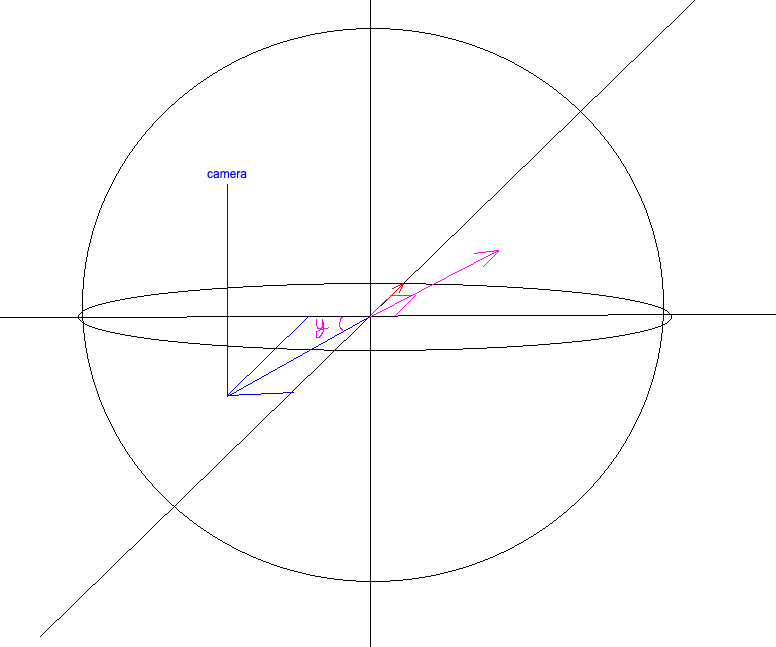
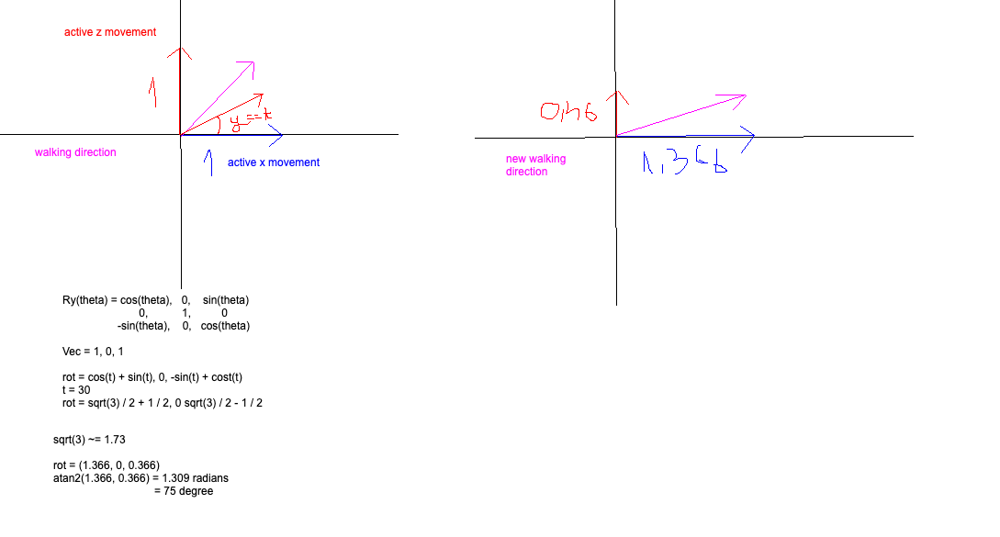

We made the block move, hooray!

Now, what we have is a movable camera, and a block that totally ignores that move. Not. Great. I mean, it is kinda great, because you want to give the player the ability to look behind while running with the same W key (so no direction change), but for now, I'd like to make it so that whenever I rotate my camera, the character rotates with it, and follows the direction of the camera.

So, first things first, a grapic, yipee.



We'll only be talking about the \[Ox, Oz] plane. We have a camera, which is defined by its orbit, and therefore by its yaw, pitch and radius. We only care about the yaw.

Now, let's assume I'm trying to move forward in the direction of the camera, so my original movement vector will be [1, 0, 0]. Now, if the camera is facing a 45 degree angle with regards to Ox (so 45 degree yaw), then my movement will have to be decomposed in the [Ox, Oz] direction, both with a value of `sqrt(2)/2`. The final amplitude of the movement is still 1, so i'm still walking 1 unit ( times whatever constant I choose ), however the direction of the walk is now changed.

So, how is this achieved? Through linear transformations!! (https://www.youtube.com/watch?v=kYB8IZa5AuE great video) The thing that takes a vector, throws it into a churn function and gets a vector in a different space (though.. still relative to the original space kinda).

So, what we do is:

```rust
let direction_vector = Vec3::new(
    direction.x * movement.normal_speed,
    0.,
    direction.y * movement.normal_speed,
);

let rotated_vector = direction_vector.rotate_axis(Vec3::Y, orbit.yaw);
```

We compute the direction vector times the constant, and then we rotate it along the Y axis (we're modifying [Ox, Oz] plane) with the camera's yaw angle.

```rust
linear_velocity.x = rotated_vector.x;
linear_velocity.z = rotated_vector.z;
```

Then we modify the linear velocity and tadaaa, we've got an object that follows our camera.

You know what still sucks about this?

The character itself doesn't rotate, like, it stays in its original transform, and just kinda slides along.. so let's fix that!

What we need to do is find the new angle between Ox and Oz and rotate the transform by that angle.

But... can't we just use yaw directly? Isn't that the purpose? Well, that's what I thought as well but NOPE. Because once we transform the rotated vector, yaw might work if we only have 1 direction active, Ox or Oz, but if we're walking in both, then both vectors compose the end result, and using yaw might get us in a position where I'm walking in a direction, but the character is facing another one.

So the solution to this is to use atan2 ( https://www.youtube.com/watch?v=VMYk9fqXz_4 great video, I recommend it ) to compute the angle by which we will be rotating our transform. And more importantly, it computes this angle from the already rotated angle, which contains the direction based on the camera's yaw.

Look, an example as to why to use atan2 instead of yaw:



```rust
let rotation = rotated_vector.x.atan2(rotated_vector.z);
transform.rotation = transform.rotation.slerp(
    Quat::from_rotation_y(rotation),
    (1. - (-TURN_SPEED * time.delta().as_millis() as f64).exp()) as f32,
);
```

You might be noticing something weird, which is the `slerp` there. Without it there, just by updating the transform directly, if I changed directions, then the character would kinda snap into position, and that looked weird. With this, we can do a slow turn movement in the direction that we wish, whose speed we can control with the `TURN_SPEED` knob.

So, if we were to rotate by yaw, we would have lost 45 degrees worth of rotation. Curses.

So, this was cool! I think in the next one I'll actually get to animating some random free 3d model.

See ya!
